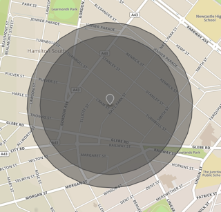

# Breaking Change in Buffer

Somewhere between 4.7.3 and 4.7.4, the results of [`@turf/buffer`][buffer] abruptly changed:

**This is a breaking change**, even if the old value was wrong and the new value right. **The results are not compatible.** The schema might be the same, but the numbers are quite different. [The semantic versioning standard insists we bump the major version][semver-8] when this happens:

> Major version X (X.y.z | X > 0) MUST be incremented if any backwards incompatible changes are introduced to the public API.

Instead, the `@turf` team released this as a semver patch.

[buffer]: https://www.npmjs.com/package/@turf/buffer
[semver-8]: https://semver.org/#spec-item-8

## Usage

* `npm install`
* `node_modules/.bin/lerna bootstrap`
* `node packages/compare/index.js`

The `@repro/before` and `@repro/after` packages each take a dependency on a version of `@turf/buffer`, and use it to return a buffer around their input. The `@repro/compare` package compares the two and outputs a GeoJSON `FeatureCollection` containing:

* The original point
* The "before" buffer
* The "after" buffer

If you'd rather just look at it, see [`demo.geojson`][demo]

[demo]: https://gist.github.com/garthk/888c7a0b8a464ec02a3bd1c4d08f8882
